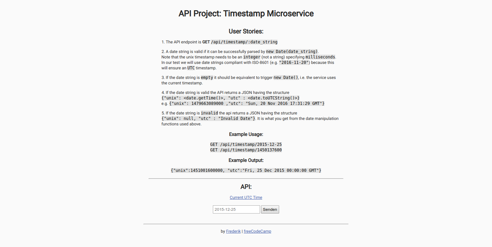

# Timestamp

## Introduction
A time string can be submitted and gets returned as JSON with the appropriate unix and UTC time strings.

This project is part of freeCodeCamps API And Microservices certificate.

***

## Project Requirements
* The API endpoint is `GET [base url]/api/timestamp/:date_string?`
* A date string is valid if it can be successfully parsed by `new Date(date_string)` (JS). Note that the unix timestamp needs to be an **integer** (not a string) specifying **milliseconds**. In our test we will use date strings compliant with ISO-8601 (e.g. `"2016-11-20"`) because this will ensure an UTC timestamp.
* If the date string is **empty** it should be equivalent to trigger `new Date()`, i.e. the service uses the current timestamp.
* If the date string is **valid** the api returns a JSON having the structure 
`{"unix": <date.getTime()>, "utc" : <date.toUTCString()> }`
e.g. `{"unix": 1479663089000 ,"utc": "Sun, 20 Nov 2016 17:31:29 GMT"}`.
* If the date string is **invalid** the api returns a JSON having the structure `{"unix": null, "utc" : "Invalid Date" }`. It is what you get from the date manipulation functions used above.

***

## Final Project
https://fcc-api-timestamp-microservice-fred.glitch.me

***

## Behind the scenes
### Backend:
* Node
* Express

### Hosting:
* Glitch

***

## Preview Images
### Main Screen:

